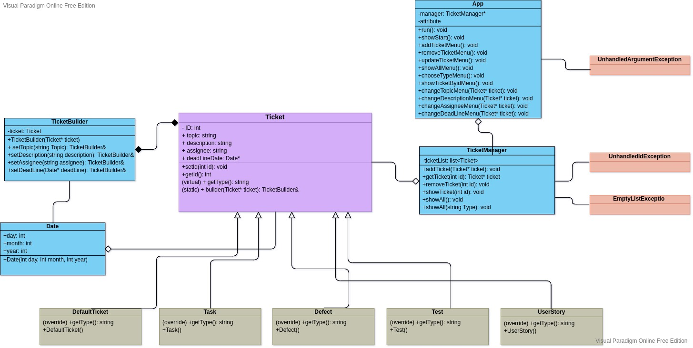

# Ticket-Manager  
https://github.com/MichalxPZ/Ticket-Manager

## Table of contents
1. [App description](#description)  
2. [Class diagram](#diagram)  
3. [Plan and project diary](#plan)  

## App description
  
This is a simple CRUD application to manage tickets in dev team. User is provided with an API to control tickets. Data is stored locally on device in JSON format. Application doesn't provide any UI right now.  
Application was created as a project for Object Programming course at Poznan University of Technology.  
The structure of application is one base abstract class Ticket and classes to represent various types of tickets. To manage configuration of each ticket I implemented a builder pattern so classes are a bit more flexible to add more fields.  
This project contains two APIs - one is basic API to manage tickets. And second one is a console user interface built on top of the first one. So user is provided with two ways of using this App.  
Below there is a UML diagram that represents the structure of my app.

Note: There is a known issue with console interface when providing unhandled type of data. UI may go in a loop when user types incorrect data for date type.

## Class diagram

## Plan and project diary

#### Diary
19.11 - created repository  
Ideas:
create some higher abstraction class of ticket and it's types (user story, defect, test, task)  
every ticket will have a lot of dependencies such as topic, description, creation date, assignee etc.
As tickets may differ from each other and not every field has to be filled I think builder is the best pattern to implement here. The app will be easy to mantain in case of any new fields like another description or status.   
29.11 refactor of classes 
2.12 consulted with lecturer how to fix the issue of not being able to create Ticket type object in the builder since it's an abstract class; The idea is to use pointers here.  
4.12 implemented classes with builder, facing some issues with memory, trying to figure out why I'm losing data injected into Ticket instances.  
4.12 resolved problems with memory, implemented working builder pattern and user interface. However there are some known issues of the UI that have to be fixed tomorrow.  
5.12 creating UML graph for ducumentation, could't resolve the issue with providing wrong argument when updating date through UI - UI goes in a loop  
9.12 during classes I made changes as my project defense, I've created virtual method in class Ticket to display topic and ID and overrided it in subclasses to display ID and topic and call the base class method and also I've overrided a plus operator for Defect class
#### Plan
5.12 - finish app development
9.12 - defense of the project
